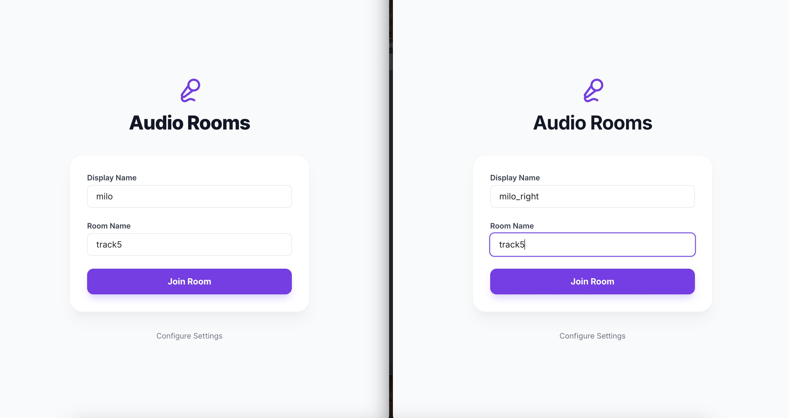
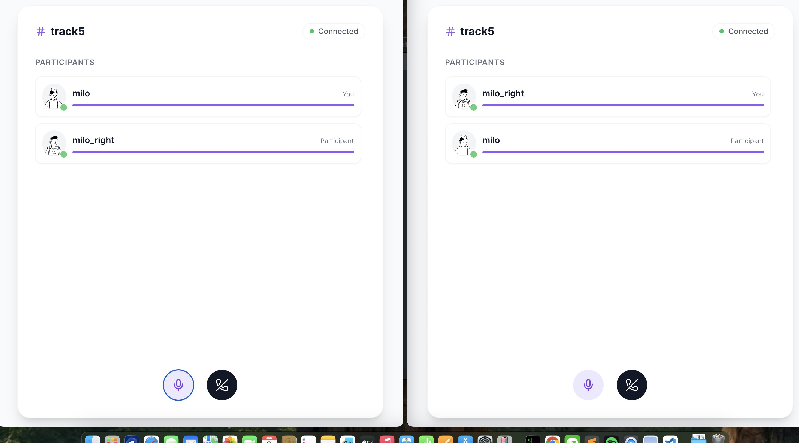

# Reflex LiveKit Audio Chat 🎙️

A real-time audio conferencing application built with [Reflex](https://reflex.dev/) and [LiveKit](https://livekit.io/).

## 📸 Interface Preview

### Lobby & Login
Simple entry point to set your display name and room ID.



### Active Audio Conference
Real-time audio visualization with active speaker detection and mute controls.

| Single User View | Multi-User Chat |
|:---:|:---:|
|  |  |

## 🌟 Features

### Core Interface
- **Lobby System**: Clean entry interface for users to input their name and join rooms.
- **Responsive Design**: Optimized layout for both desktop and mobile views using Tailwind CSS.
- **Real-time Status**: Visual indicators for connection state (Connected, Reconnecting, Disconnected).

### Audio Conferencing
- **Room Management**: Seamless room joining and leaving functionality.
- **Audio Controls**: Toggle mute/unmute with instant visual feedback.
- **Active Speaker Detection**: Visual highlighting of currently speaking participants.
- **Participant List**: Real-time roster showing all users currently in the room.

## 🛠 Tech Stack

- **Framework**: [Reflex](https://reflex.dev/) (Python-based web framework)
- **Real-time Engine**: [LiveKit](https://livekit.io/) (WebRTC infrastructure)
- **Styling**: Tailwind CSS
- **Package Manager**: Poetry

## 🚀 Getting Started

### Prerequisites

- **Python**: version 3.11 (e.g., 3.11.x)
- **Poetry**: [Installation Guide](https://python-poetry.org/docs/#installation)

### Installation

1. **Clone the repository**

   ```bash
   git clone <your-repo-url>
   cd reflex_livekit_audio_chat
   ```

2. **Install dependencies**

   ```bash
   poetry install
   ```

3. **Environment Setup**

   Create a `.env` file in the root directory (or set these variables in your environment) with your LiveKit credentials:

   ```env
   LIVEKIT_URL=<your-livekit-url>
   LIVEKIT_API_KEY=<your-api-key>
   LIVEKIT_API_SECRET=<your-api-secret>
   ```

### Running the Application

### Running the App

Start the development server (via Poetry env):

```bash
poetry run reflex run
```

The application will be available at `http://localhost:3000`.

For quick restarts during development (kills anything on ports 3000/8000, then restarts Reflex):

```bash
poetry run ./reflex_rerun.sh
```

### Python version help (common first-run issue)

If you see an error like `Current Python version (3.x) is not allowed by the project (>=3.11,<3.12)`, point Poetry at a 3.11 interpreter and retry:

macOS (Homebrew Python 3.11):

```bash
brew install python@3.11
poetry env use /opt/homebrew/bin/python3.11
poetry install
```

If you already have `python3.11` on your PATH (e.g., from Xcode CLT or an existing install), you can simply run:

```bash
poetry env use python3.11
poetry install
```

After switching, rerun the server:

```bash
poetry run reflex run
```


## 📄 License

This project is licensed under the MIT License - see the [LICENSE](LICENSE) file for details.
